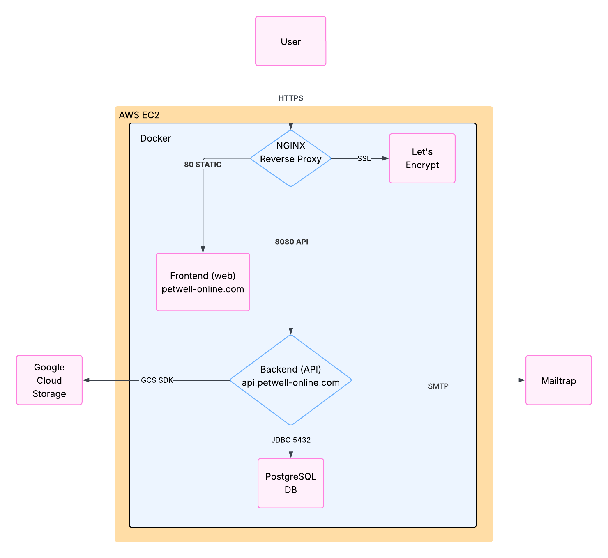
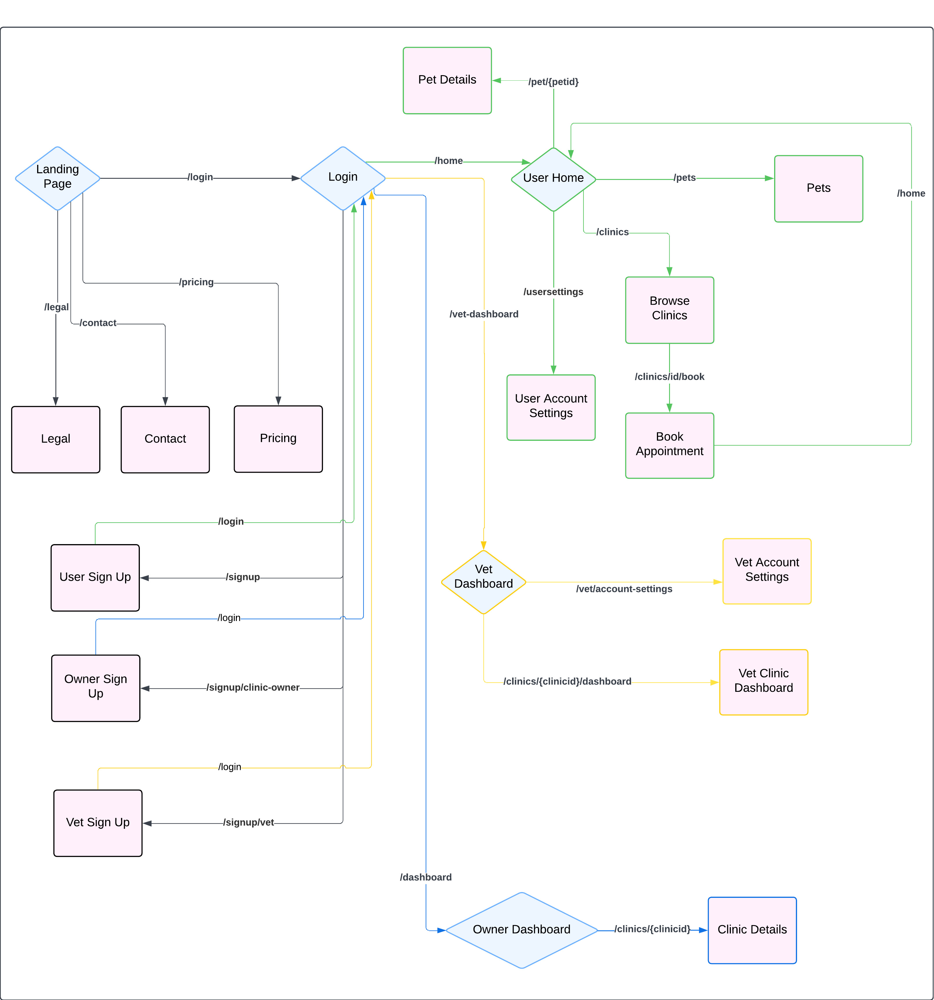
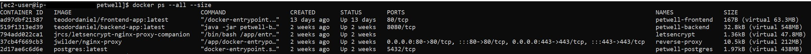
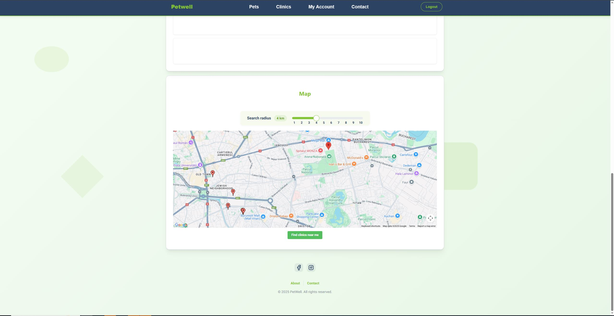
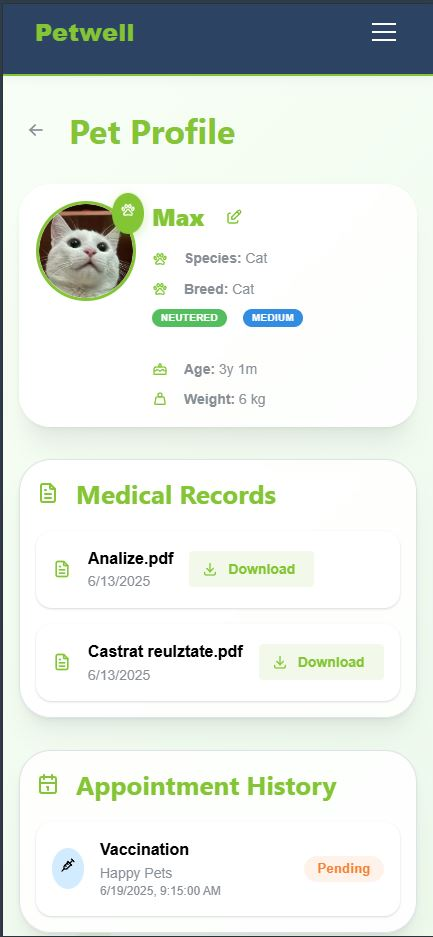
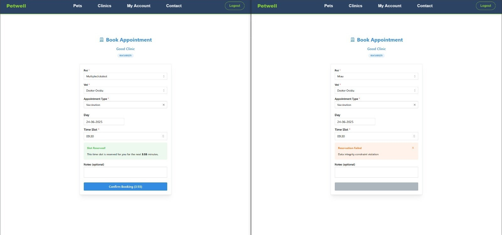

# PetWell Veterinary Health Management Platform

PetWell is a full-stack digital platform designed to simplify the management of pets health. It bridges the gap between pet owners and veterinary clinics by centralizing medical records, appointment scheduling, and clinic communication into a modern, device-independent application.

## Why did I create PetWell?

The continuous increase in the number of companion animals in Romania highlights the need for a digital solutions that supports the efficient management of their health.

The main problems i tried to solve:

- Finding a suitable veterinary clinic  
- Scheduling consultations  
- Maintaining a coherent medical history

**PetWell** addresses this gap by providing:

- Centralized medical records per pet  
- Real-time appointment and communication tools  
- Role-based access for pet owners and veterinary professionals  

## Architecture Overview

PetWell is designed using a client-server model with a monolithic backend and a single-page frontend application:

- **Backend:** Spring Boot (Java), REST API, JWT-secured, PostgreSQL, GCS

- **Frontend:** React (JavaScript), responsive SPA

- **Deployment:** Docker, Nginx reverse proxy, HTTPS via Let's Encrypt, hosted on AWS EC2

## Technologies Used

| Layer      | Tech Stack |
|------------|------------|
| Backend    | Spring Boot, Java, PostgreSQL, Google Cloud Storage |
| Frontend   | React JS, Google Maps API |
| Auth       | JSON Web Tokens (JWT) |
| Email      | MailTrap |
| Deployment | Docker, Nginx, AWS EC2, AWS Route 53, Let's Encrypt |

## Noteworthy Features & Implementations

### Google Maps API Clinic Location Discovery

PetWell integrates the **Google Maps Places API** to allow pet owners to find nearby veterinary clinics.

- **Frontend (React)**:
  - Uses `@react-google-maps/api`
  - Autocomplete search for locations
  - Clinics displayed as markers on the map

- **Backend (Spring Boot)**:
  - Uses latitude & longitude for geolocation filtering
  - PostgreSQL query with Haversine formula returns clinics within a radius

### Cloud File Uploads Medical Records & Attachments

PetWell allows users and vets to upload images, PDFs, or other medical documents to **Google Cloud Storage (GCS)**.

- **Frontend**:
  - Uses `FormData` to send files via HTTP POST
  - File previews displayed before upload

- **Backend**:
  - Validates content type and size
  - Uploads via the official GCS SDK
  - Files organized by pet ID

### Appointment Scheduling Logic

Appointments between pet owners and veterinarians are handled with real-time availability and status tracking.

- **Frontend**:
  - Calendar interface to select available time slots
  - Real-time feedback on availability

- **Backend**:
  - Appointment stored with status: `PENDING`, `APPROVED`, `REJECTED`
  - Prevents double-booking
  - Sends email or in-app notification to veterinarian

